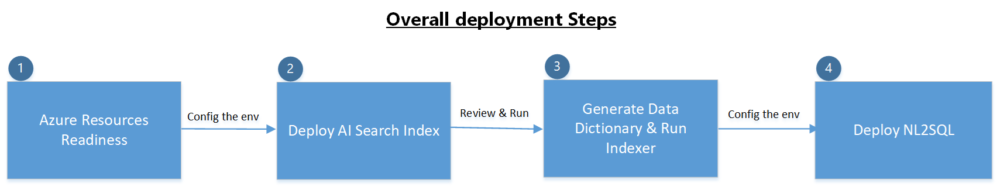

# Getting Started with Agentic NL2SQL Systems

The guide will use PostgreSQL as data source reference to deploy the NL2SQL solutions.

# Deployment Overview 
The guide covers the steps prerequisite Azure resources, environment configurations, code installation, and deployment steps for the systems.

## Section I:
## Prerequisites of Azure Resources readiness
Before beginning the setup process, ensure you have the following:

### Resources check
In your development machine (recommend to use Azure Virtual Machine), Python 3.11 or higher should be installed.

An Azure subscription with permissions to create and manage resources:

- Azure OpenAI with GPT-4o, GPT-4o-mini models and embedding model
- Azure AI Search service
- Azure Storage Account
- Azure Container App with Azure Container Register
- Azure SQL for PostgreSQL Database (here as reference data source in this deployment guide)

### Access and permission check
When all above resources are onboard, make sure following access permissions are granted:
- Azure OpenAI
>Grant "Azure AI Developer" role and "Cognitive Services OpenAI Contributor" roles to the NL2SQL host , e.g., the Virtual Machine Identity (system or user assigned)
- Azure AI Search service
>Grant "Search Index Data Contributor " and "Search Service Contributor" roles to the NL2SQL host , e.g., the Virtual Machine Identity (system or user assigned)
- Azure Storage Account
>Grant "Storage Blob Data Contributor" role to above Azure AI Search service and the NL2SQL host , e.g., the Virtual Machine Identity (system or user assigned)
- Azure Container App with Azure Container Register
>Configure User Assinged Managed Identity (recommended)
- Azure SQL for PostgreSQL Database
>Configure the basic user login permissions for the NL2SQL usage.

* also make sure that the networking are proper configured for above components.

## Section II:
## AI Search Indexes Deployment
The system requires several AI Search indexes for its operation. Follow these steps to deploy them:

### Navigate to the deploy_ai_search_indexes directory
>cd deploy_ai_search_indexes

### Create a .env file from the example
>cp .env.example .env
### Edit the .env file with your Azure resource information
>remove not used environment settings if not used, e.g., other extra database connnection infomation.

### Install dependencies
>uv sync --extra postgres

### Deploy the AI Search indexes

This step will create the following indexes:
- Schema Store Index - for database schema metadata
- Column Value Store Index - for sample data values
- Query Cache Index - for caching previously executed queries

Reference following commend to create:
>uv run --env-file .env src/deploy_ai_search_indexes/deploy.py --index_type text_2_sql_schema_store [add --rebuild REBUILD if already run this command] 
>uv run --env-file .env src/deploy_ai_search_indexes/deploy.py --index_type text_2_sql_column_value_store [add --rebuild REBUILD if already run this command] 
>uv run --env-file .env src/deploy_ai_search_indexes/deploy.py --index_type text_2_sql_query_cache [add --rebuild REBUILD if already run this command] 

## Section III:
## Data Dictionary Preparation
The Data Dictionary is crucial for the NL2SQL system to understand your database schema.

### Step 1: Generate the data dictionary files.
Set up your database connection in the .env file:
>cd text2sql_core
>cp .env.example .env
### Edit the .env file as well as with your database connection details
Generate the data dictionary for your database:
### For PostgreSQL
>uv run --env-file .env nl2sql_core/src/text_2_sql_core/data_dictionary/postgres_data_dictionary_creator.py

If the above command run success, there will have following three folder with json files for each tables will been created under `nl2sql`, which are:
- schema_store
- column_value_store
- query_cache 

* For other supported databases to use in future, just run with the corresponding creator module.

### Step 2: Review, upload and trigger the indexer build.

1. Review the descriptions in schea_store files, make neccessary changes for the content.
2. Upload the generated files to Azure Storage Account containers accordingly (make sure to match with your .env settings)
3. Those files will be automatically indexed every 24 hours against your indexes create time, or you can use AI Search Indexer to run it immidiatelly.

## Section IV:
## NL2SQL Setup

### Step 1. setup NL2SQL core
### Navigate to text_2_sql_core
>cd nl2sql_core

### Create environment file
Environment Configuration Options
The .env file contains various configuration options that allow you to customize the behavior of the NL2SQL system:

>cp .env.example .env
### Edit the .env file with your configuration

### Install dependencies and database option for PostgreSQL
>uv sync --extra postgres

### Step 2. AutoGen Implementation Setup
The AutoGen implementation uses the Text2SQL core to provide an agentic approach:

### Navigate to autogen directory
>cd autogen

### Install dependencies with additional database connectors
>uv sync --extra postgres

Once set up, you can test the implementation by running the provided notebook:

### Open and run the notebook
jupyter notebook "Agentic Vector Based NL2SQL.ipynb"

# Production Deployment Considerations
When deploying to production, consider the following:

## Security Recommendations
Use managed identities for Azure resources where possible
Limit database permissions to read-only for the Text2SQL service
Add validation of SQL queries before execution
Consider data masking for sensitive columns

## Performance Optimization
Pre-populate the query cache with common questions
Implement an effective caching strategy
Use pre-assembled tables/views to avoid complex joins
Consider scaling options for the Azure resources

## Troubleshooting

Common issue and possible solution:

Connection errors to Azure resources:	Verify network connectivity, check firewall settings, ensure correct connection strings
Data dictionary generation failures:	Verify database permissions, check connection details
SQL query execution errors:	Validate SQL syntax, check database permissions, verify column names
Image processing failures:	Ensure Document Intelligence service is properly configured, check file format support
Cache indexing issues:	Check storage account permissions, verify index definitions
Logging:
The system uses Python's logging module. To enable detailed logging, set the log level in your environment variables:

>LOGGING_LEVEL=DEBUG
